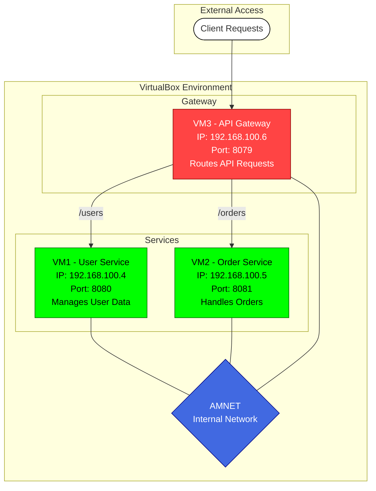

```mermaid
graph TB
    subgraph "External Access"
        Client([Client Requests])
    end

    subgraph "VirtualBox Environment"
        subgraph "Gateway"
            VM3[VM3 - API Gateway<br/>IP: 192.168.100.6<br/>Port: 8079<br/>Routes API Requests]
        end

        subgraph "Services"
            VM1[VM1 - User Service<br/>IP: 192.168.100.4<br/>Port: 8080<br/>Manages User Data]
            VM2[VM2 - Order Service<br/>IP: 192.168.100.5<br/>Port: 8081<br/>Handles Orders]
        end

        NET{AMNET<br/>Internal Network}
    end

    Client --> VM3
    VM3 -->|/users| VM1
    VM3 -->|/orders| VM2
    VM1 --- NET
    VM2 --- NET
    VM3 --- NET

    style VM1 fill:#00FF00,stroke:#006400,color:#000000
    style VM2 fill:#00FF00,stroke:#006400,color:#000000
    style VM3 fill:#FF4444,stroke:#8B0000,color:#FFFFFF
    style NET fill:#4169E1,stroke:#000080,color:#FFFFFF
    style Client fill:#FFFFFF,stroke:#000000
```
